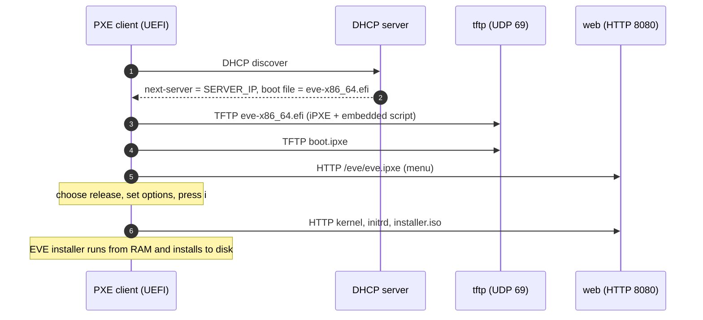

<div align="center">

# EVE-Netboot-Installer

**Network-install [LF Edge EVE-OS](https://github.com/lf-edge/eve) on bare metal: PXE boot, pick a release, press `i`.**

[](LICENSE)
[](https://github.com/michiel-zededa/eve-netboot-installer/actions/workflows/image.yml)
[](https://github.com/michiel-zededa/eve-netboot-installer/actions/workflows/test.yml)


</div>

EVE-Netboot-Installer is a self-contained PXE boot server for EVE-OS. It runs as a small Docker Compose stack on any Linux host, NAS or VM, including a VM on an EVE edge node.

What it does:

- **Keeps a mirror up to date:** a local mirror of the latest EVE-OS LTS releases.
- **Includes your own builds:** it adds your own installer ISOs, such as controller-specific builds.
- **Serves one boot menu:** everything is offered in a single iPXE menu. No USB sticks, no BMC virtual media, no per-release fiddling.

```text
 LF Edge EVE-OS
 GitHub LTS releases (local mirror, updated 2026-10-05 11:27):
     17.0.6-lts  kvm  (2026-09-18)
     16.0.4-lts  kvm  (2026-08-27)
     14.5.5-lts  kvm  (2026-06-30)
 Local installers (import folder):
     zedcloud-17.0.6-kvm-amd64.iso  (2026-10-03 14:12)
 Options:
     Installation options...  [disk: automatic, reboot: on]
     iPXE shell
     Boot from local disk
     Reboot
     (no key pressed within 300 s: boot from local disk)
```

---

## Contents

- [Features](#features)
- [How it works](#how-it-works)
- [Requirements](#requirements)
- [Quick start](#quick-start)
- [Deployment options](#deployment-options)
- [Configuration](#configuration)
- [DHCP](#dhcp)
- [Your own installer ISOs](#your-own-installer-isos)
- [Operation](#operation)
- [Languages](#languages)
- [Security considerations](#security-considerations)
- [Limitations](#limitations)
- [Repository layout](#repository-layout)
- [Contributing](#contributing)
- [License](#license)

## Features

| | |
|---|---|
| **Always current** | Mirrors the newest patch release of the newest *N* EVE-OS **LTS** lines from GitHub, for `amd64`/`arm64` and the `kvm`/`k` variants. It verifies every download against its sha256 and removes releases you no longer need. |
| **Bring your own installer** | Every EVE installer ISO (volume id `EVEISO`) in the import folder appears in the menu within a minute. This includes controller-specific builds with onboarding certificates in `config.img`. |
| **All installer options at boot** | Set them at boot: target disk, persist disk(s), controller (`eve_install_server`), serial console, soft serial, reboot after install, wipe all disks, debug/pause, and extra kernel arguments. Defaults come from `.env`. |
| **Safe by default** | A summary screen requires an explicit **`i`** before installing. Without input, the menu falls back to the local disk after a timeout, so a machine that PXE boots by accident never stalls. |
| **Own iPXE build** | iPXE (x86_64 and arm64 UEFI) is compiled from the official sources during the image build. Only two DHCP options are needed, with no other boot infrastructure. |
| **Status page** | A read-only web page lists every release and local ISO with its architecture, variant, size and checksum state. It is also available as JSON. |
| **Multilingual** | Menu and status page in English, German, French, Spanish, Portuguese, Dutch, Danish and Norwegian. |
| **One `.env` file** | Every setting lives in `.env`. It is portable across plain Docker, NAS compose plugins and VMs. |

## How it works



The stack consists of one image in three roles:

| Service | Role |
|---|---|
| `sync` | Mirrors GitHub releases, scans the import folder and generates the iPXE menu, the status page and `boot.ipxe`. |
| `tftp` | Serves the iPXE binaries and `boot.ipxe` (host networking, UDP 69). |
| `web` | nginx: menu, kernels, initrds, ISOs and the status page. |

### Why not `sanboot` the ISO?

The EVE installer searches for its ISO again once Linux is running, and a SAN-emulated CD-ROM is gone by then. EVE's own netboot path therefore puts the whole ISO *inside* the initrd and boots with `root=/installer.iso`. EVE-Netboot-Installer reproduces exactly that kernel command line, parsed from each ISO's own `grub.cfg`, and drives it from iPXE.

See [docs/how-it-works.md](docs/how-it-works.md) for the details.

## Requirements

**Host**

- Linux with Docker Engine and the Compose plugin (v2), on amd64 or arm64.
- The TFTP service uses host networking, so Docker Desktop on macOS/Windows is not suitable.

**Ports**

- UDP 69 (TFTP).
- TCP 8080 (HTTP, configurable).

**Disk**

- About 0.5 GB per mirrored `kvm` variant and 0.7 GB per `k` variant.
- The defaults (3 LTS lines, amd64 `kvm`) need about 2 GB.

**DHCP**

- A server on which you can set *next-server* (option 66) and the *boot file name* (option 67).

**Targets**

- UEFI with network boot enabled.
- RAM: the whole installer ISO is loaded into memory, so plan for at least 2 GB (`kvm`) or 8 GB (`k`).

## Quick start

```sh
git clone https://github.com/michiel-zededa/eve-netboot-installer.git
cd eve-netboot-installer
cp .env.example .env
$EDITOR .env                  # set SERVER_IP to this host's LAN address
docker compose up -d          # the first start builds the image (~5 min)
```

Then:

1. **Point DHCP at the host:** next-server = `SERVER_IP`, boot file = `eve-x86_64.efi`. See [docs/dhcp.md](docs/dhcp.md).
2. **Open the status page** at `http://SERVER_IP:8080/` and wait for the first sync to finish.
3. **Boot a machine:** network boot it, pick a release, review the options and press **`i`**.

> [!WARNING]
> The EVE installer wipes the target disk without further confirmation. The menu always shows a summary first and only installs after **`i`** is pressed.

### Using the prebuilt image

Every push to `main` publishes a multi-arch image to the GitHub Container Registry. To skip the local build, add it to `.env`:

```sh
EVE_IMAGE=ghcr.io/michiel-zededa/eve-netboot-installer:latest
```

Then pull and start without building:

```sh
docker compose pull && docker compose up -d --no-build
```

## Deployment options

| Platform | Guide |
|---|---|
| Any Linux host with Docker Compose | [Quick start](#quick-start) |
| A compose manager or NAS (web UI that runs compose stacks) | [Compose managers and NAS](#compose-managers-and-nas) |
| EVE-OS edge node (ZEDEDA) or any hypervisor | [deploy/debian-vm](deploy/debian-vm/README.md): a cloud-init Debian VM that installs and runs the stack by itself |

### Compose managers and NAS

Web UIs that manage compose stacks usually keep `compose.yaml` and its environment in their own folder, not in a checkout of this repository. The stack works unchanged there:

- **Stack file:** paste [compose.yaml](compose.yaml) as it is.
- **Environment:** start from [.env.example](.env.example).
- **Paths:** use absolute paths for `DATA_DIR` and `IMPORT_DIR`, because relative paths resolve against the manager's stack folder.
- **Image, option 1 (prebuilt):** set `EVE_IMAGE=ghcr.io/michiel-zededa/eve-netboot-installer:latest` and nothing has to be built.
- **Image, option 2 (local build):** clone this repository somewhere on the host and set `EVE_SRC_DIR` to that absolute path. Update with `git pull` in that folder followed by a rebuild of the stack.

Points to check on a shared host:

- **HTTP port:** many NAS web interfaces use port 80 themselves; keep `HTTP_PORT` on 8080 or another free port.
- **TFTP:** only one TFTP server can use UDP 69. Stop any other PXE stack first. With `IPXE_ALIASES_X86_64` the iPXE binary is also published under the boot file name your DHCP server already hands out, so switching needs no DHCP change.
- **Backups:** `DATA_DIR/www/eve/releases` holds the mirrored ISOs. Exclude it from backups if you like; it is downloaded again automatically.

## Configuration

Everything is configured in `.env`; [.env.example](.env.example) documents every option. The most important ones:

| Variable | Default | Description |
|---|---|---|
| `SERVER_IP` | *(required)* | Address PXE clients use to reach this host |
| `HTTP_PORT` | `8080` | HTTP port for the menu, files and status page |
| `DATA_DIR` | `./data` | Mirror, menu and TFTP files |
| `IMPORT_DIR` | `./import` | Folder scanned for your own installer ISOs |
| `EVE_LANGUAGE` | `en` | `en` `de` `fr` `es` `pt` `nl` `da` `no` |
| `EVE_ARCHES` | `amd64` | `amd64`, `arm64` or both |
| `EVE_FLAVOURS` | `kvm` | `kvm`, `k` or both |
| `EVE_LTS_LINES` | `3` | Number of LTS lines to mirror |
| `EVE_MENU_TIMEOUT` | `300` | Seconds until the menu boots the local disk (`0` = wait) |
| `EVE_MENU_MODE` | `standalone` | `chained` when called from another iPXE menu (exit returns to that menu instead of the local disk) |
| `EVE_DEFAULT_*` | | Default values of the installation options (disk, persist disk, controller, serial console, …) |
| `IPXE_ALIASES_X86_64` | | Extra file names for the iPXE binary, to match a boot file name your DHCP already hands out |
| `GITHUB_TOKEN` | | Optional; raises the GitHub API rate limit |

Apply changes with `docker compose up -d`. The menu is regenerated on every start.

## DHCP

Two options are enough:

| Option | Value |
|---|---|
| 66 / next-server | `SERVER_IP` |
| 67 / boot file | `eve-x86_64.efi` (x86_64 UEFI) or `eve-arm64.efi` (arm64 UEFI) |

[docs/dhcp.md](docs/dhcp.md) has examples for:

- UniFi;
- dnsmasq;
- ISC dhcpd and Kea;
- OPNsense/pfSense;
- MikroTik, including per-architecture boot files.

## Your own installer ISOs

Drop an EVE installer ISO, or an `*installer-net.tar`, anywhere below `IMPORT_DIR`.

- **Detection:** it is recognised by its volume id `EVEISO`; other ISOs in the same folder are ignored.
- **When it appears:** in the menu within about a minute.
- **Changes:** replacing or deleting the file updates the menu as well.
- **Variant:** the variant is derived from the file name: a `k` or `kubevirt` token (for example `installer.k.iso`) means `k`, anything else `kvm`.

## Operation

| Task | Command |
|---|---|
| Follow logs | `docker compose logs -f sync` (or `tftp`, `web`) |
| Check GitHub now | `docker compose restart sync` |
| Update | `git pull && docker compose up -d --build` |
| Stop | `docker compose down` (data in `DATA_DIR` is kept) |

The status page (`http://SERVER_IP:HTTP_PORT/`) links to the generated menu (`/eve/eve.ipxe`) and a machine-readable `/eve/status.json`.

## Languages

Set `EVE_LANGUAGE` to one of the languages below:

| Code | Language |
|---|---|
| `en` | English |
| `de` | Deutsch |
| `fr` | Français |
| `es` | Español |
| `pt` | Português |
| `nl` | Nederlands |
| `da` | Dansk |
| `no` | Norsk |

How the translations work:

- Translations live in [app/i18n](app/i18n).
- Missing keys fall back to English.
- iPXE menu text is transliterated to ASCII automatically, for example `ä → ae` and `ø → oe`.

**Adding a language:** copy `en.json`, translate the values and open a pull request.

## Security considerations

- **No authentication:**
  - PXE, TFTP and the HTTP mirror are unauthenticated by design. Run the server in a trusted network or VLAN.
  - Installer ISOs in the import folder may contain controller onboarding certificates, and anyone on that network can download them.
- **Disk wiping:**
  - Installing EVE erases disks. Keep network boot below the local disk in the boot order of production machines, or rely on the menu timeout.
  - The stack never installs without an explicit key press.
- **Integrity:** GitHub downloads are checked against the sha256 published with each release.

## Limitations

- **UEFI only:** legacy BIOS PXE is not supported.
- **Boot file per architecture:** a DHCP server that hands out one boot file to all clients gives arm64 machines the x86 binary. Use per-architecture DHCP rules (see [docs/dhcp.md](docs/dhcp.md)).
- **`config.img` overrides:** `grub.cfg` overrides inside an ISO's `config.img` are not applied with this boot method. The `config.img` itself (controller, certificates) is.
- **arm64 testing:** the arm64 path is built and served but has had less hardware testing than amd64.

## Repository layout

```text
.
├── compose.yaml           # the stack (sync, tftp, web)
├── .env.example           # all settings, documented
├── Dockerfile             # multi-stage: iPXE build + runtime image
├── app/
│   ├── eve_sync.py        # mirror, import, menu and status page generator
│   └── i18n/              # translations
├── docker/                # iPXE build script, embedded iPXE script, entrypoint
├── docs/                  # how it works, DHCP configuration
├── tests/                 # unit tests + EVE GRUB fixtures
└── deploy/
    └── debian-vm/         # cloud-init Debian VM for EVE nodes / any hypervisor
```

## Contributing

Issues and pull requests are welcome. Useful contributions include:

- reports from real hardware (vendor, model, architecture);
- additional DHCP server examples;
- new translations.

Before submitting:

- run the unit tests: `python3 -m unittest discover -s tests` (standard library only, no Docker needed);
- after editing `deploy/debian-vm/files/`, regenerate `user-data.yaml` with `python3 deploy/debian-vm/build-user-data.py`;
- keep the generated iPXE script ASCII-only;
- test a boot in a VM (QEMU with OVMF works well).

CI runs the tests, `ruff` and `shellcheck` on every pull request.

## License

Licensed under the [Apache License 2.0](LICENSE).

## Acknowledgements

- [LF Edge EVE-OS](https://github.com/lf-edge/eve): the edge operating system this project installs.
- [iPXE](https://ipxe.org): network boot firmware. It is built from the [official sources](https://github.com/ipxe/ipxe) during the image build and is licensed under GPLv2.

EVE-Netboot-Installer is an independent community project and is not affiliated with or endorsed by LF Edge.
