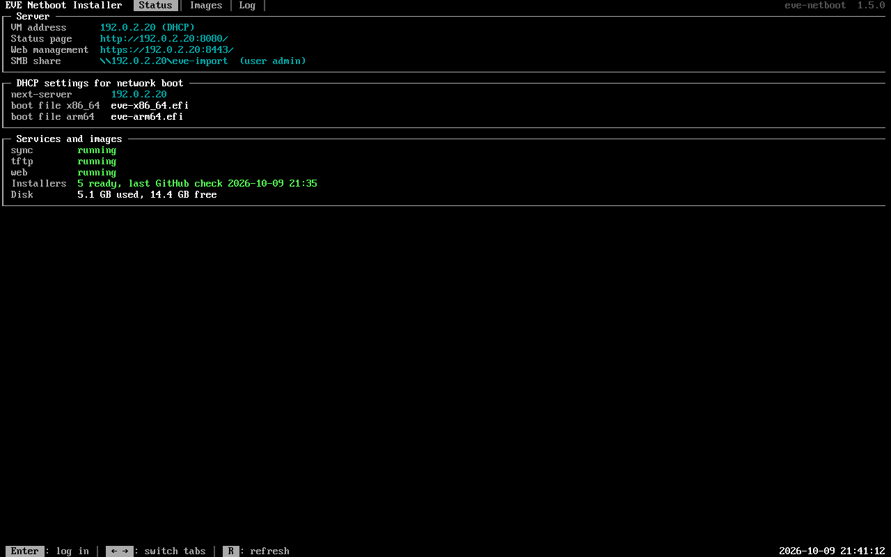
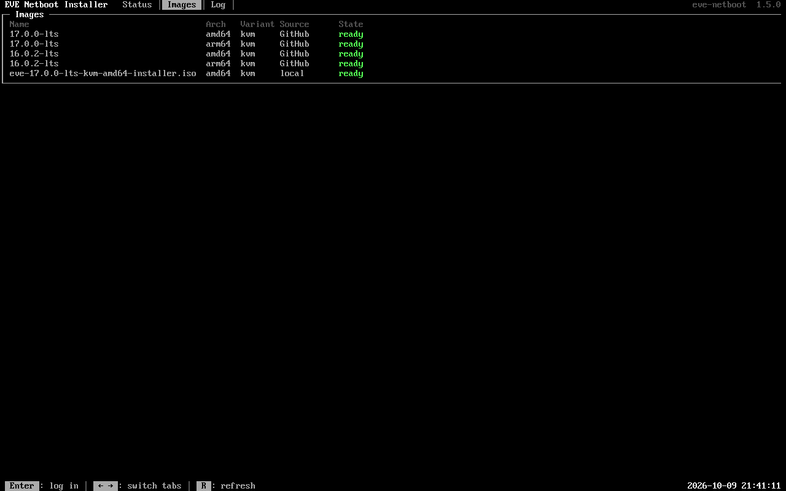
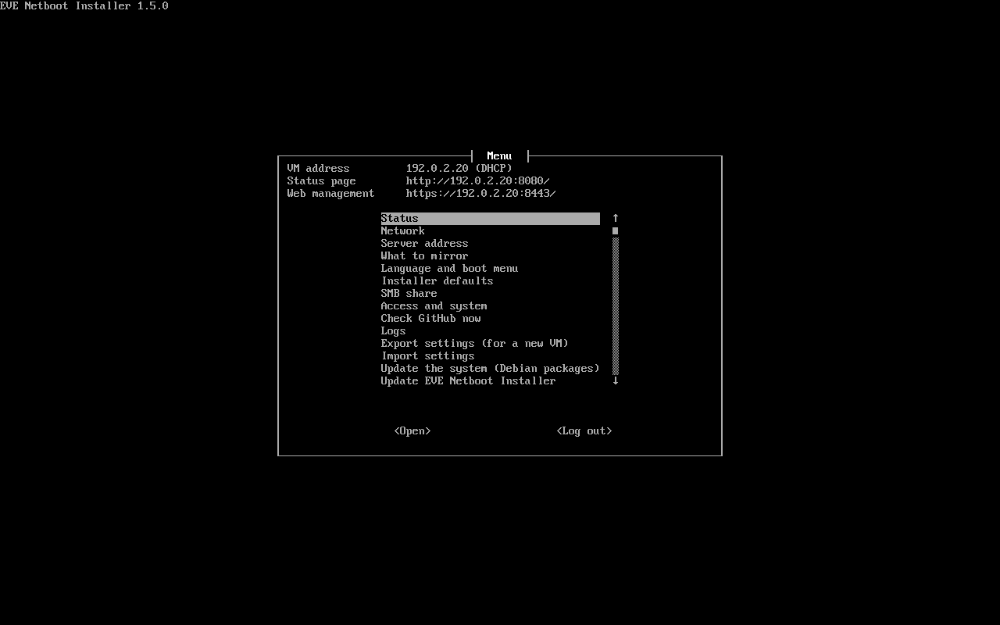

# EVE Netboot Installer VM appliance

A ready-made virtual machine that runs the EVE Netboot Installer PXE boot
server. Download it, import it into your hypervisor, start it and answer a few
questions on its screen. No Linux or Docker knowledge needed.

- **Works everywhere:** KVM, Proxmox, libvirt, ZEDEDA / EVE-OS, VMware and other hypervisors.
- **Three ways to set it up:**
  - **on the VM's screen:** a setup menu asks for everything;
  - **in a web browser** (`https://<VM address>:8443/`), for VMs without a screen;
  - **automatically through cloud-init:** you pass the settings when you deploy the VM (ZEDEDA, Proxmox, libvirt, OpenStack). The VM sets itself up with no questions.
- **Web UI in the ZEDEDA look:** the available images (GitHub mirror and your own ISOs), status and boot settings for everyone on port 8080; all management on port 8443 after logging in.
- **Stays up to date:** Debian security updates install automatically. The menu updates the system and the application, and rolls back an application update that does not work.

```text
 LAN ──────────────────────────────────────────────────────────────
   │                                  │
 PXE clients                    hypervisor ── bridged / switch network
                                      │
                                VM "eve-netboot"   (own LAN address)
                                  ├─ setup menu + status on the VM screen
                                  ├─ web management (HTTPS 8443, admin login)
                                  ├─ tftp (UDP 69) · web UI (TCP 8080) · sync
                                  └─ import folder for your own installer ISOs
```

---

## Contents

1. [Download](#1-download)
2. [What the VM needs](#2-what-the-vm-needs)
3. [Create the VM](#3-create-the-vm) (ZEDEDA, Proxmox, libvirt, VMware)
4. [Set it up](#4-set-it-up): [on the screen](#4a-on-the-vm-screen), [in a browser](#4c-in-a-web-browser) or [through cloud-init](#4b-through-cloud-init)
5. [Point DHCP at the VM](#5-point-dhcp-at-the-vm)
6. [Daily use](#6-daily-use)
7. [Your own installer ISOs](#7-your-own-installer-isos)
8. [Updates](#8-updates)
9. [Replace the VM with a newer version](#9-replace-the-vm-with-a-newer-version)
10. [All settings](#10-all-settings)
11. [Troubleshooting](#11-troubleshooting)
12. [Security](#12-security)

---

## 1. Download

Every [release](https://github.com/michiel-zededa/eve-netboot-installer/releases/latest)
has these files under *Assets*:

| File | For |
|---|---|
| `eve-netboot-<version>-amd64.qcow2` | KVM, Proxmox, libvirt, ZEDEDA / EVE-OS on x86 (Intel/AMD) |
| `eve-netboot-<version>-arm64.qcow2` | the same on ARM 64-bit (EVE-OS on ARM, Ampere, ...) |
| `eve-netboot-<version>-amd64.ova` | VMware ESXi / vSphere, Workstation, Fusion (Intel) |
| `eve-netboot-<version>-amd64.vmdk` | VMware, when you add the disk to a VM yourself |
| `SHA256SUMS` | checksums to verify the download |

The architecture of the VM does not limit the machines you install: an amd64
VM installs arm64 machines too, and the other way round.

Optional check of the download:

```bash
sha256sum -c SHA256SUMS --ignore-missing
```

---

## 2. What the VM needs

| | Minimum | Recommended |
|---|---|---|
| vCPU | 1 | 2 |
| RAM | 1 GB | 2 GB |
| Disk | 16 GB (the image size) | 32 GB: more room for mirrored releases and your own ISOs |
| Network | 1 adapter | |

- **Disk size:** give the VM a bigger disk if you like; the VM grows into it by itself at boot.
- **Network:** the VM must be in the **same layer-2 network (VLAN)** as the machines that network boot, so use a *bridged* network (Proxmox `vmbr0`, libvirt bridge, VMware port group, ZEDEDA **Switch** network instance), not NAT.
- **A stable address:** the DHCP server will point the machines at this VM. Use a DHCP reservation for the VM's MAC address, or set a fixed address in the setup.
- **Internet access:** outbound HTTPS to GitHub (`github.com`, `api.github.com`, `objects.githubusercontent.com`) for the EVE-OS releases, and to `deb.debian.org` for updates.

---

## 3. Create the VM

Choose your platform. When the VM starts, continue with [step 4](#4-set-it-up).

### ZEDEDA / EVE-OS

The names of buttons differ between ZEDEDA releases; look for the closest match.

1. **Upload the image:** *Library → Images → Add*
   - type: **VM image (qcow2)**, architecture matching the node;
   - give it the download URL of the `.qcow2` from the release page, or upload the file.
2. **Create a Switch network instance** on the node: *Network instances → Add → Kind: Switch*, port: the adapter connected to the LAN of the machines you want to install.
3. **Create an Edge App:** *Marketplace → Edge Apps → Add*
   - deployment type **VM**;
   - resources: 2 vCPU, 2048 MB RAM;
   - drive: the image from step 1, size **32 GB**;
   - one network interface;
   - **Custom configuration (cloud-init):** paste your settings, see [step 4B](#4b-through-cloud-init). Leave it empty to set the VM up on its screen instead.
4. **Deploy** an instance of the Edge App to the node and attach its interface to the Switch network instance.
5. Without cloud-init settings: open the instance's **remote console** and continue with [step 4A](#4a-on-the-vm-screen).

The `KEY=VALUE` format works well with variables in the custom configuration: put a variable where a value goes (for example for `ADMIN_PASSWORD` and `EVE_DEFAULT_INSTALL_SERVER`) and fill it in per deployment.

### Proxmox VE

1. Copy the `.qcow2` to the Proxmox host, for example to `/root`.
2. Create a VM without a disk, here with ID 120 and bridge `vmbr0` (change both to yours):

   ```bash
   qm create 120 --name eve-netboot --memory 2048 --cores 2 --net0 virtio,bridge=vmbr0 --scsihw virtio-scsi-single --ostype l26
   ```

3. Import the disk (change `local-lvm` to your storage) and boot from it:

   ```bash
   qm disk import 120 /root/eve-netboot-<version>-amd64.qcow2 local-lvm
   ```

   ```bash
   qm set 120 --scsi0 local-lvm:vm-120-disk-0 --boot order=scsi0 && qm disk resize 120 scsi0 32G
   ```

4. **Optional, settings through cloud-init:** put your settings file ([step 4B](#4b-through-cloud-init)) on a storage with the content type *Snippets* (for `local`: `/var/lib/vz/snippets/eve-netboot.txt`) and attach it:

   ```bash
   qm set 120 --ide2 local-lvm:cloudinit --cicustom "user=local:snippets/eve-netboot.txt"
   ```

5. Start the VM and open its **Console**.

### libvirt / virt-install (KVM)

Give the disk room first (the VM grows into it at boot), then create the VM:

```bash
qemu-img resize eve-netboot-<version>-amd64.qcow2 32G
```

```bash
virt-install --name eve-netboot --memory 2048 --vcpus 2 --import --osinfo debian12 --disk eve-netboot-<version>-amd64.qcow2,bus=virtio --network bridge=br0,model=virtio --graphics vnc
```

- Change `br0` to the bridge of your LAN.
- Add `--cloud-init user-data=eve-netboot.txt` to pass settings ([step 4B](#4b-through-cloud-init)).
- Open the screen with `virt-manager` or `virt-viewer eve-netboot`.

### VMware ESXi / vSphere / Workstation

1. **Deploy OVF Template** (ESXi / vCenter) or **File → Open** (Workstation), and choose the `.ova` file.
2. Map the network **PXE LAN** to the port group of the machines you want to install.
3. Optionally increase the disk size, then power on.
4. Open the **VM console** and continue with [step 4A](#4a-on-the-vm-screen).

### Other hypervisors

Convert the image with `qemu-img`, for example for Hyper-V (generation 1):

```bash
qemu-img convert -O vhdx eve-netboot-<version>-amd64.qcow2 eve-netboot.vhdx
```

These conversions are not tested; please report how it went.

---

## 4. Set it up

### 4A. On the VM screen

When the VM has no settings yet, its screen shows the setup. Use the **arrow
keys**, **Space** (to tick a box), **Tab** (to move between fields and
buttons) and **Enter**.

| Step | What to enter |
|---|---|
| Language | English, Deutsch, Français, Español, Português, Nederlands, Dansk or Norsk: the language of this setup, the menu, the web management, the boot menu and the status page. |
| Welcome | **Set up this VM**, or **Import the settings of another EVE Netboot Installer VM** (see [step 9](#9-replace-the-vm-with-a-newer-version)) |
| Admin password | Twice, at least 8 characters. You need it for the menu and for SSH (user `admin`). |
| Network | **Automatically (DHCP)**, or **Fixed address (static)**: address with prefix (`192.168.1.20/24`), gateway, DNS servers. |
| Server address | **This VM's own address** (almost always right). |
| What to mirror | Architectures of your machines, EVE-OS variants (`kvm`, and `k` with Kubernetes), and how many LTS release lines (each about 0.5 GB per architecture and variant). |
| Installer defaults | Your controller, for example `zedcloud.zededa.net` (empty = what is in the ISO), and the serial console of your machines. |
| SMB share | **Share it** to copy your own installer ISOs to the VM from Windows or macOS (a Windows/macOS file share of the import folder). |
| Ready | Check the summary and choose **Apply**. |

After about a minute the screen shows the status, in the style of EVE-OS's own
console: tabs at the top (**Status**, **Images**, **Log**; switch with the
**arrow keys** or **Tab**), boxes with coloured states, and the keys and a clock
at the bottom:



The *Images* tab lists every installer with its state:



Continue with [step 5](#5-point-dhcp-at-the-vm).

### 4B. Through cloud-init

If your platform passes cloud-init user-data to the VM (ZEDEDA *custom
configuration*, Proxmox `cicustom`, libvirt `--cloud-init`, OpenStack), the VM
reads its settings from there at the first boot and starts by itself. Two
formats work; use the one your platform makes easiest.

**Plain `KEY=VALUE` lines** ([reference with every setting](examples/eve-netboot.env)):

```sh
ADMIN_PASSWORD=Change-Me-Please-1
SERVER_IP=auto
ENI_LANGUAGE=en
EVE_ARCHES=amd64
EVE_DEFAULT_INSTALL_SERVER=zedcloud.zededa.net
```

**A `#cloud-config`** with an `eve_netboot:` section ([reference with every setting](examples/cloud-config.yaml)). The rest of the file is standard cloud-init and applies to the user `admin`:

```yaml
#cloud-config
eve_netboot:
  SERVER_IP: auto
  ENI_LANGUAGE: en
  EVE_DEFAULT_INSTALL_SERVER: zedcloud.zededa.net
password: Change-Me-Please-1
chpasswd:
  expire: false
ssh_authorized_keys:
  - ssh-ed25519 AAAA... you@laptop
```

- **Lines you leave out** keep their default ([all settings](#10-all-settings)).
- **When the settings are applied:** at the first boot, and again whenever the user-data changes. Settings you change later in the menu stay until then.
- **Comments:** put them on their own line. Put quotes around a value that contains ` #`.
- **Access:** set a password (`ADMIN_PASSWORD`, `ADMIN_PASSWORD_HASH`, or cloud-init's `password:`) and/or an SSH key (`ADMIN_SSH_KEYS` or `ssh_authorized_keys:`). Without either, the VM screen asks for a password the first time you open the menu.
- **Mistakes:** a setting with a wrong value is reported on the VM screen (*Last error*); nothing half-applied is left behind.

---

### 4C. In a web browser

For a VM you cannot see the screen of (headless):

1. Find the VM's address in your DHCP server or hypervisor.
2. Open `https://<VM address>:8443/` (type `https://`). The browser warns once about the certificate: the VM makes its own (self-signed) certificate. Accept it to continue: in Safari *Show Details → visit this website*, in Chrome *Advanced → Proceed*. An address typed without `https://` is sent on to it.
3. The same steps as on the screen follow. The first page asks for the language (the page switches right away); then admin password, network, server address, what to mirror, installer defaults and SMB share. Or start from the settings of another VM: the address its console shows under *Export settings*, or the exported settings file (*Backup and restore → Export → Download* on the other VM).
4. After **Apply and start** you are logged in to the [web management](#6-daily-use).

- **Who may do this:** until the VM is set up, anyone who reaches this page can do the setup (first come, first served). Set the VM up right after deploying it, or use cloud-init.
- **After a setup on the VM's screen** the web management is off; switch it on in the menu: *Access and system → Web management*.

---

## 5. Point DHCP at the VM

Set two options on the DHCP scope of the LAN; the VM screen shows the values:

| Option | Value |
|---|---|
| next-server / TFTP server (option 66) | the VM's address |
| boot file name (option 67) | `eve-x86_64.efi` for x86_64 UEFI, `eve-arm64.efi` for arm64 UEFI |

[docs/dhcp.md](../docs/dhcp.md) has the settings for UniFi, dnsmasq, ISC dhcpd,
Kea, OPNsense/pfSense and MikroTik, and
[docs/deployment.md](../docs/deployment.md#6-first-network-boot) describes the
first network boot of a machine.

---

## 6. Daily use

**In a web browser:**

- `http://<VM address>:8080/` is the public side, for everyone in the network: the available images (GitHub mirror and your own ISOs) with their details, live activity such as downloads, and the DHCP and boot settings. A **Manage** button leads to the management.
- `https://<VM address>:8443/` is the management: log in with the admin password. It has the same settings pages as the menu below (in the same groups), the logs, updates, backup and restore, the admin password, reboot and power off, plus:
  - **Upload ISO** and **Delete** on the *Images* page (no SMB or scp needed);
  - **Download diagnostics**: one file with logs, status and settings (without passwords or tokens) for troubleshooting;
  - **network changes with a safety net:** a new address must be confirmed from that address within 2 minutes, otherwise the previous settings come back by themselves.

**On the VM screen** the status is always visible. Press **Enter** and type the
admin password to open the menu. The console and the web management use the
language chosen under *Language and boot menu* (`ENI_LANGUAGE`), the same as
the boot menu.



Dialogs use colour to show what they are about, as in EVE-OS's console: red
for errors and for questions that stop the server (power off), orange for
warnings, green for success.

**Over SSH:** `ssh admin@<VM address>` opens the same menu. *Command line*
leaves it; `eve-netboot menu` brings it back.

| Menu item | Does |
|---|---|
| Status | Everything on one screen |
| Network, Server address, What to mirror, Language and boot menu, Installer defaults, SMB share, Access and system | The same groups of settings as the pages of the web management: a list of the settings with their values; **Enter** changes one, **Done** applies the changes |
| Check GitHub now | Normally this happens at the set interval (every day) |
| Logs | The mirror (sync), TFTP, web server, appliance or system log |
| Export settings / Import settings | See [step 9](#9-replace-the-vm-with-a-newer-version) |
| Update the system / Update EVE Netboot Installer | See [step 8](#8-updates) |
| Change the admin password, Reboot, Power off, Command line, Log out | |

The status page `http://<VM address>:8080/` lists every release and ISO the
VM offers.

---

## 7. Your own installer ISOs

EVE installer ISOs you put in the import folder appear in the boot menu within
a minute, for example controller-specific builds.

- **Windows / macOS:** switch on the SMB share (menu or web management → *SMB share*). Then open `\\<VM address>\eve-import` (Windows Explorer) or `smb://<VM address>/eve-import` (macOS Finder: *Go → Connect to Server*), log in as `admin` with the share password and copy the ISO there.
- **Web browser:** *Images → Upload ISO* in the web management (`https://<VM address>:8443/`).
- **scp:** `scp my-installer.iso admin@<VM address>:/srv/eve-netboot/import/`

The EVE-OS version and variant are read from the ISO itself; the file name
does not matter. Deleting or replacing the file updates the menu.

---

## 8. Updates

| What | How | Risk |
|---|---|---|
| Debian security updates | Automatically, every day | Very low: fixes within Debian 13 only |
| All Debian updates | Menu → *Update the system* | Low: apt upgrade within Debian 13; the appliance's packages are protected against `autoremove`; the menu checks the services afterwards and offers a reboot when a new kernel was installed |
| EVE Netboot Installer | Menu → *Update EVE Netboot Installer* | Low: if the new version does not start correctly, the previous one is restored automatically |
| A new Debian release, a new appliance version | A new VM, see [step 9](#9-replace-the-vm-with-a-newer-version) | |

Tip: take a snapshot of the VM before updating if your hypervisor supports it.

---

## 9. Replace the VM with a newer version

A new release of the VM image contains the newest Debian and application. To
move to it without setting everything up again:

1. **On the old VM:** web management → *Backup and restore* → *Download* gives the file `eve-netboot-settings.txt`. Or menu → *Export settings*: it shows an address like `http://192.168.1.20:8080/export-3fa9c1.txt` that works for 15 minutes, and puts the same file into the SMB share.
2. **Create the new VM** from the new image ([step 3](#3-create-the-vm)) and start it.
3. **Import on the new VM:** in the web setup choose the downloaded file (or type the address). On the new VM's screen choose **Import the settings of another EVE Netboot Installer VM** and type the address, or pick the file after copying it into the new VM's SMB share.
4. Go through the setup steps; the old values are filled in. Set the admin password (passwords are never exported).
5. If the old VM had a **fixed address**: power the old VM off before you choose **Apply**, or the two VMs use the same address.
6. **DHCP:** with a fixed address or `SERVER_IP` nothing changes. With DHCP, the new VM has a new MAC address: move the DHCP reservation to it, or update next-server.
7. Copy your own ISOs to the new VM ([step 7](#7-your-own-installer-isos)) and delete the old VM.

With cloud-init (ZEDEDA) it is simpler: deploy the new image with the same
custom configuration. The exported text is valid cloud-init user-data too.

---

## 10. All settings

The VM keeps its settings in `/etc/eve-netboot/settings.env`. The menu changes
them; cloud-init user-data and imports use the same names.

- **`ENI_*`:** EVE Netboot Installer itself; **`EVE_*`:** EVE-OS (which releases are mirrored, and as `EVE_DEFAULT_*` the defaults of its installation options); the rest configure the VM.
- **Before 1.3** the `ENI_*` settings were called `EVE_*` as well (`EVE_LANGUAGE`, ...). The VM converts the old names automatically, in its settings, in cloud-init user-data and in imports.

Two reference files show every setting with its syntax, an explanation and
the default value. Both work as they are, as cloud-init user-data:

| File | Syntax |
|---|---|
| [examples/eve-netboot.env](examples/eve-netboot.env) | `KEY=VALUE` lines, the same as a Docker Compose `.env` |
| [examples/cloud-config.yaml](examples/cloud-config.yaml) | `#cloud-config` with an `eve_netboot:` section, plus the standard cloud-init keys for `admin` |

**The VM itself**

| Setting | Default | Meaning |
|---|---|---|
| `ADMIN_PASSWORD` | | Password of `admin`. Applied and then forgotten (never stored in the settings). |
| `ADMIN_PASSWORD_HASH` | | The same as a hash, made with `openssl passwd -6`; safer in user-data |
| `ADMIN_SSH_KEYS` | | SSH public key(s) for `admin`, several separated by `;` |
| `SSH_PASSWORD_LOGIN` | `yes` | `no` = SSH only with a key |
| `HOSTNAME` | `eve-netboot` | Host name of the VM |
| `TZ` | `UTC` | Time zone, for example `Europe/Amsterdam` |
| `NET_MODE` | `dhcp` | `dhcp` or `static` |
| `NET_ADDRESS` | | With `static`: address with prefix, `192.168.1.20/24` |
| `NET_GATEWAY` | | With `static`: default gateway (empty = none) |
| `NET_DNS` | | With `static`: DNS servers, separated by spaces |
| `NET_INTERFACE` | | With `static` and several adapters: the adapter that gets the address (default: the first) |
| `SMB_IMPORT_SHARE` | `no` | `yes` = share the import folder as `\\<VM>\eve-import` |
| `SMB_PASSWORD` | | Password of that share (user `admin`). Applied and then forgotten. |
| `WEB_ADMIN` | `yes` | Web management on `https://<VM>:8443/`. A VM set up on its screen starts with `no` |
| `WEB_ADMIN_PORT` | `8443` | Port of the web management (not `HTTP_PORT`, not 69) |

**The PXE server** (the same as in [.env.example](../.env.example))

| Setting | Default | Meaning |
|---|---|---|
| `SERVER_IP` | `auto` | Address the PXE clients use; `auto` = the VM's own |
| `HTTP_PORT` | `8080` | Port of the status page and the boot menu |
| `ENI_LANGUAGE` | `en` | `en` `de` `fr` `es` `pt` `nl` `da` `no` |
| `EVE_ARCHES` | `amd64` | `amd64`, `arm64` or both (`amd64 arm64`) |
| `EVE_FLAVOURS` | `kvm` | `kvm`, `k` or both |
| `EVE_LTS_LINES` | `3` | How many EVE-OS LTS release lines to mirror |
| `ENI_MENU_TIMEOUT` | `300` | Seconds before the boot menu boots the local disk |
| `EVE_DEFAULT_INSTALL_SERVER` | | Default controller in the installation options |
| `EVE_DEFAULT_SERIAL` | `none` | Default serial console: `ttyS0`, `ttyS1`, `ttyAMA0` |
| `EVE_DEFAULT_*` | | All other installation option defaults from `.env.example` |
| `IPXE_ALIASES_X86_64` | | Extra boot file name(s) for the iPXE binary |
| `ENI_GITHUB_TOKEN` | | Only when the GitHub API limit is reached (shared public IP) |

`DATA_DIR`, `IMPORT_DIR` and `ENI_SRC_DIR` are fixed in the VM and ignored.

---

## 11. Troubleshooting

| Symptom | Check |
|---|---|
| The VM screen stays black | ZEDEDA / Proxmox: the VM needs a VGA/virtual display; the setup runs on the first screen (tty1). |
| *Starting, please wait* for a long time | The first boot applies the settings and starts the services; give it 2-3 minutes. After 15 minutes the screen continues anyway; *Last error* on the status screen says what went wrong. |
| The setup appears although you passed cloud-init settings | The settings were not recognised: plain `KEY=VALUE` lines, or a `#cloud-config` with an `eve_netboot:` section. A file that starts with `#!` (a script) is not read. |
| VM address *none* | No DHCP answer: check that the VM is on a bridged/switch network; or set a fixed address (menu → *Network*). |
| PXE client: *PXE-E32 TFTP open timeout* | DHCP next-server is the VM's address? The VM is not behind NAT? Menu → *Show the log*; `curl -s tftp://<VM address>/boot.ipxe` from another machine. |
| Installers *0 ready* | The first download is still running (menu → *Show the log*), or the VM has no internet access. |
| The browser warns about the certificate on port 8443 | Expected: the VM makes its own certificate. Accept it once for this address (Safari: *Show Details → visit this website*; Chrome: *Advanced → Proceed*; Firefox: *Advanced → Accept the Risk*). |
| Port 8443 does not answer | Web management is off after a setup on the VM's screen: menu → *Advanced settings → Web management*. |
| After a network change in the browser the page is gone | Open the new address within 2 minutes and confirm there; otherwise the previous settings come back by themselves. |
| Forgot the admin password | Log in with an SSH key if you set one, or deploy a new VM and import the settings ([step 9](#9-replace-the-vm-with-a-newer-version)). |

Logs: menu → *Command line*, then `sudo journalctl -u eve-netboot-setup` and `sudo cat /var/log/eve-netboot.log`.

---

## 12. Security

- **No authentication on the PXE side:** the boot menu, TFTP and the mirror are open to the LAN, as PXE requires. Run the VM in a trusted network; your own ISOs (which can contain controller certificates) can be downloaded by anyone on that network.
- **The admin account:**
  - The VM screen shows only the status; the menu needs the admin password.
  - `admin` may run the menu without typing the password again; everything else with `sudo` asks for it.
  - Without a password or key, the VM screen asks to set a password the first time; anyone with access to the VM console can do that, so set one in the setup or through cloud-init.
- **The web management:**
  - Only over HTTPS (port 8443), with a login using the admin password; the public side on port 8080 is read-only.
  - After 5 wrong passwords from one address, logging in from there is blocked for a minute.
  - Before the VM is set up, the web setup is open to anyone who reaches it (first come, first served). Set the VM up right after deploying, or pass the settings through cloud-init.
  - It can be switched off completely (`WEB_ADMIN=no`); it is off after a setup on the VM's screen.
- **Passwords in cloud-init:** `ADMIN_PASSWORD` is not stored in the VM's settings, but the hypervisor keeps the user-data. `ADMIN_PASSWORD_HASH` avoids a readable password there.
- **Exports** contain no passwords or tokens and are available for 15 minutes only.

---

## Build it yourself

The images are built by [vm/build/build.sh](build/build.sh) from the Debian 13
cloud image, on every version tag ([image.yml](../.github/workflows/image.yml)).
To build one locally (Linux with KVM, or macOS for the native architecture):

```bash
vm/build/build.sh --arch amd64 --version 1.5.1
```

| Path | Contents |
|---|---|
| `vm/rootfs/` | Files copied into the VM: the `eve-netboot` command, systemd units, network and cloud-init configuration |
| `vm/build/build.sh` | Downloads the Debian image, boots it with QEMU and runs `provision.sh` inside |
| `vm/build/provision.sh` | Installs Docker (from Debian), the application image and the appliance files, then cleans up |
| `vm/build/eve-netboot.ovf.in` | OVF descriptor of the VMware OVA |
| `vm/examples/` | Settings references (`KEY=VALUE` and `#cloud-config`), also used by the tests |
